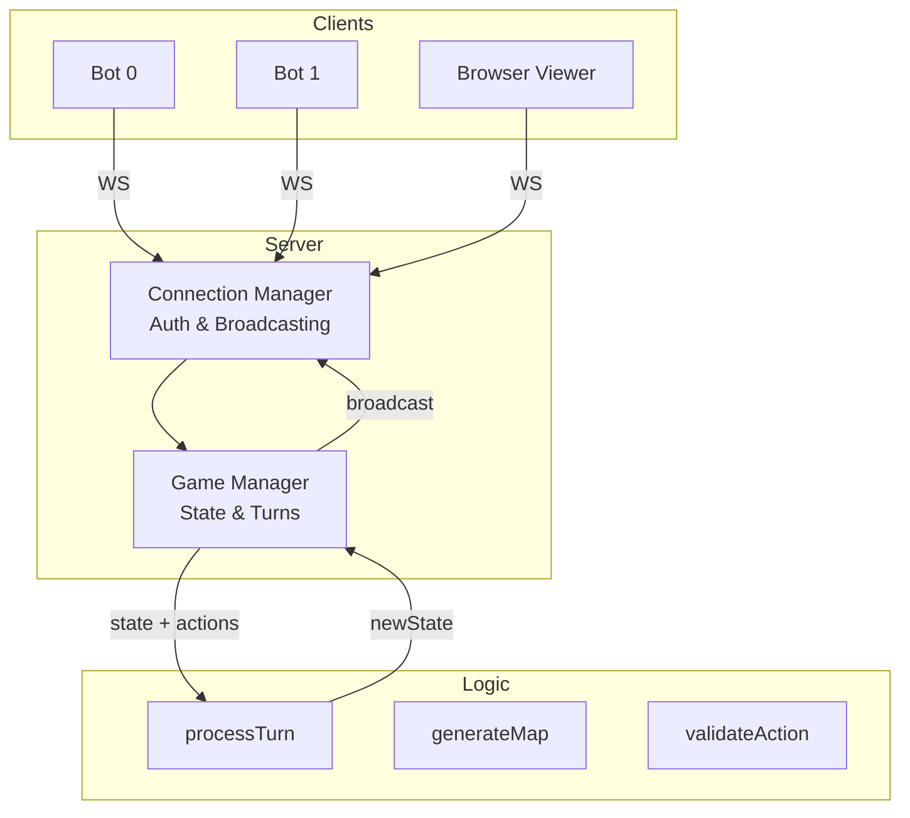
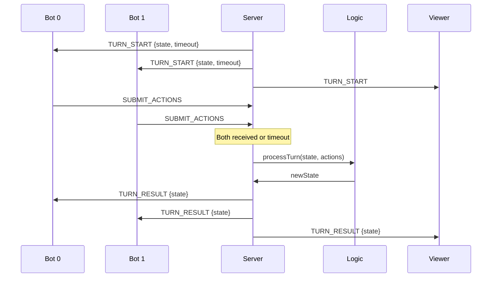
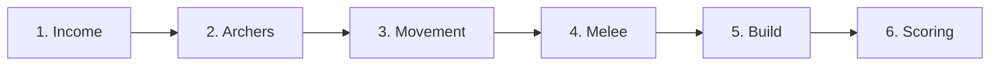

# Repository Structure

## Overview

Three layers: **game logic** (stateless, zero dependencies), **WebSocket server** (state + connections), **browser frontend** (visualization + manual play). Each works independently.



## Logic Layer -- `/logic/`

Stateless pure functions. Same input, same output. No dependencies.

| Export               | Signature                                                   | Purpose                      |
| -------------------- | ----------------------------------------------------------- | ---------------------------- |
| `processTurn`        | `(state, {player0, player1})` -> `{newState, errors, info}` | Run all 6 turn phases        |
| `createInitialState` | `(options)` -> `state`                                      | New game with generated map  |
| `generateMap`        | `(width, height, seed)` -> `map`                            | Symmetrical island map       |
| `validateAction`     | `(state, teamId, action)` -> `{valid, reason}`              | Validate one action          |
| `validateActions`    | `(state, teamId, actions)` -> `{valid, errors}`             | Validate an array of actions |

Utilities: `getTilesAtDistance1`, `getTilesAtDistance2`, `chebyshevDistance`, `manhattanDistance`, `isInBounds`, `getTile`, `getUnit`, `getCity`, `isPassable`, `isInZoC`, `isAdjacentToOwnTerritory`.

Constants (unit stats, economy, scoring, terrain) in `constants.js`, re-exported from the index.

## Server Layer -- `/server/`

Node.js + `ws` library.

**GameManager** (`game-manager.js`):

- Owns the game state
- Calls `createInitialState()` and `processTurn()` each turn
- Turn timeout (default 2s) -- processes when both submit or timeout expires
- Auto-saves completed games to `server/saves/`
- Auto-restarts 3s after game end
- Supports pause/resume, settings changes, oversight mode

**ConnectionManager** (`connections.js`):

- WebSocket auth, client tracking, broadcasting
- Default mode: shared password `"player"`, client picks team
- Protected mode (`--protected`): per-team passwords from `passwords.json`

**Entry point** (`server.js`):

- Wires up managers, routes messages
- Flags: `--protected`, `--mode=blitz|standard`, `--timeout=2000`, `--max-saves=20`

## Frontend -- `/visuals/`

Vanilla JS, Canvas 2D, Tailwind via CDN. No build step.

| File                     | Purpose                                     |
| ------------------------ | ------------------------------------------- |
| `js/app.js`              | WebSocket connection, state, mode switching |
| `js/canvas/renderer.js`  | Isometric rendering engine                  |
| `js/canvas/isometric.js` | Coordinate math (64x32 tiles), zoom/pan     |
| `js/canvas/tiles.js`     | Terrain and ownership rendering             |
| `js/canvas/units.js`     | Unit sprites and animation                  |
| `js/ui/panels.js`        | HUD panels and controls                     |
| `js/game/manual-play.js` | Human play mode                             |
| `js/game/oversight.js`   | Bot action review mode                      |
| `js/game/pathfinding.js` | Client-side pathfinding                     |

Modes: spectator, manual play, oversight review, replay.

## Turn Processing



## Turn Phases



1. **Income** -- gold from territory (0.5G/tile) and cities (5G/city)
2. **Archers** -- auto-fire at nearest enemy in range 2, cannot move after shooting
3. **Movement** -- MOVE actions, ZoC enforced, territory raiding, city capture
4. **Melee** -- soldiers/raiders auto-attack all adjacent enemies, simultaneous damage
5. **Build** -- BUILD_UNIT, BUILD_CITY, EXPAND_TERRITORY, gold deducted
6. **Scoring** -- monument control, score awards, end conditions

## File Map

```
civilisation-clash/
|-- logic/
|   |-- index.js              # Entry, re-exports everything
|   |-- processor.js           # Turn processor (6 phases)
|   |-- constants.js           # Unit stats, economy, scoring
|   |-- map-generator.js       # Symmetrical island generation
|   |-- validation.js          # Action validation, spatial helpers
|   |-- terminal.js            # ASCII visualization
|   +-- tests/
|       |-- logic.test.js
|       |-- test-agents.js
|       |-- dumbAgent.js
|       +-- smarterAgent.js
|
|-- server/
|   |-- server.js              # Entry, message routing
|   |-- game-manager.js        # State, turns, saves
|   |-- connections.js          # Auth, broadcasting
|   |-- passwords.json
|   +-- saves/
|
|-- visuals/
|   |-- index.html
|   |-- serve.js               # Static file server
|   |-- css/styles.css
|   |-- js/
|   |   |-- app.js
|   |   |-- canvas/
|   |   |   |-- renderer.js
|   |   |   |-- isometric.js
|   |   |   |-- tiles.js
|   |   |   +-- units.js
|   |   |-- ui/panels.js
|   |   +-- game/
|   |       |-- manual-play.js
|   |       |-- oversight.js
|   |       +-- pathfinding.js
|   +-- assets/units/
|
|-- agents/
|   |-- client.js              # WebSocket client harness
|   |-- dumbAgent.js
|   |-- smarterAgent.js
|   |-- smart2Agent.js
|   +-- run-match.js
|
|-- docs/
+-- package.json
```

## Tech Stack

| Component | Technology                              |
| --------- | --------------------------------------- |
| Logic     | Pure JS (CommonJS), zero dependencies   |
| Server    | Node.js + `ws`                          |
| Frontend  | Vanilla JS + Tailwind CSS (CDN)         |
| Rendering | Canvas 2D, isometric (64x32)            |
| Testing   | `node --test logic/tests/logic.test.js` |
