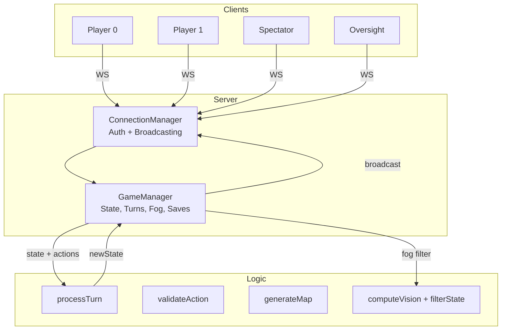

# Repository Structure

## Overview

Three layers: **game logic** (stateless, zero dependencies), **WebSocket server** (state + connections), **browser frontend** (visualization + manual play). Each works independently.



## File Map

```
civilisation-clash/
|-- install_and_start.sh       # One-command install + start (Linux/Mac)
|-- install_and_start.bat      # One-command install + start (Windows)
|
|-- logic/
|   |-- index.js               # Entry, re-exports everything
|   |-- processor.js            # Turn processor (6 phases)
|   |-- constants.js            # Unit stats, economy, scoring, modes
|   |-- map-generator.js        # Symmetrical island generation
|   |-- validation.js           # Action validation, spatial helpers
|   |-- vision.js               # Per-player vision computation
|   |-- fog.js                  # State/event filtering for fog of war
|   |-- terminal.js             # ASCII visualization
|   |-- package.json            # Package metadata
|   +-- tests/
|       +-- logic.test.js       # Unit tests (node --test)
|
|-- server/
|   |-- server.js               # Entry, WebSocket listener, message routing
|   |-- game-manager.js         # Game lifecycle, turns, saves, fog, oversight
|   |-- connections.js           # Auth, team assignment, broadcasting
|   |-- passwords.json           # Auth passwords (players, spectator, oversight, per-team)
|   +-- saves/                   # Auto-saved game replays (JSON)
|
|-- visuals/
|   |-- index.html               # Main page
|   |-- serve.js                 # Static file server (node visuals/serve.js)
|   |-- css/
|   |   |-- styles.css           # Custom styles
|   |   +-- tailwind.css         # Tailwind CSS (pre-built)
|   |-- js/
|   |   |-- app.js               # WebSocket connection, state, mode switching
|   |   |-- canvas/
|   |   |   |-- renderer.js      # Isometric rendering engine, fog view
|   |   |   |-- isometric.js     # Coordinate math (64x32 tiles), zoom/pan
|   |   |   |-- tiles.js         # Terrain and territory rendering
|   |   |   +-- units.js         # Unit sprites and animation
|   |   |-- ui/
|   |   |   +-- panels.js        # HUD panels, keyboard shortcuts
|   |   +-- game/
|   |       |-- manual-play.js   # Human play mode
|   |       |-- oversight.js     # Bot action review mode
|   |       +-- pathfinding.js   # Client-side pathfinding
|   +-- assets/
|       |-- units/               # Unit sprites (per team)
|       +-- icons/               # UI icons
|
|-- agents/
|   |-- client.js                # WebSocket bot runner (node agents/client.js <agent> <team>)
|   |-- dumbAgent.js             # Random move bot
|   |-- smarterAgent.js          # Heuristic bot
|   |-- smart2Agent.js           # Variant heuristic bot
|   |-- econAgent.js             # Economy-focused bot
|   |-- python_example.py        # Example bot (Python, requires websockets)
|   +-- run-match.js             # Headless match runner (no server needed)
|
|-- docs/
|   |-- index.html               # Documentation viewer
|   |-- quickstart.md
|   |-- game-mechanics.md
|   |-- building-a-client.md
|   |-- server-reference.md
|   |-- data-extraction.md
|   |-- using-the-ui.md
|   +-- architecture.md
```

## Logic Layer - `/logic/`

Stateless pure functions. Same input, same output. No dependencies.

- **processor.js** - The turn processor. Runs all 6 phases: income, archer fire, movement, melee, build, scoring.
- **constants.js** - All game constants: unit stats, damage multipliers, economy parameters, scoring values, mode settings, terrain types, vision radii.
- **validation.js** - Action validation (MOVE, BUILD_UNIT, BUILD_CITY, EXPAND_TERRITORY, PASS). Also has geometry helpers: distance calculations, adjacency checks, ZoC detection, connected territory.
- **map-generator.js** - Symmetrical island generation using Perlin noise. Handles standard (25x15), blitz (15x11), and tournament (25x23) maps.
- **vision.js** - Computes per-player vision from units, cities, and territory.
- **fog.js** - Filters game state and events so each player only sees what is in their vision. Monuments are never filtered.
- **terminal.js** - ASCII rendering of game state for debugging and headless play.
- **index.js** - Re-exports everything from the above files plus constants.

See [Data Extraction](#data-extraction) for the full function reference.

## Server Layer - `/server/`

Node.js + `ws` library. Wraps the stateless logic engine with multiplayer, auth, timeouts, fog filtering, saves, and oversight.

- **server.js** - WebSocket listener, message routing, CLI argument parsing. Defines all client/server message type constants. See [Server Reference](#server-reference) for flags and message types.
- **game-manager.js** - Owns the game state. Calls `createInitialState()` and `processTurn()` each turn. Handles turn timeouts (default 2s), fog of war filtering, auto-saves, auto-restart (3s after game end), pause/resume, oversight mode, and settings changes.
- **connections.js** - WebSocket auth, client tracking, targeted broadcasting (`send`, `broadcast`, `sendToTeam`, `broadcastToSpectators`, `sendToOversight`). Open mode (shared password, client picks team) and protected mode (per-team passwords).
- **passwords.json** - Auth passwords for players, spectator, oversight, and per-team (protected mode).

## Frontend - `/visuals/`

Vanilla JS, Canvas 2D, Tailwind CSS. No build step required.

- **serve.js** - Static file server on port 3000. Run with `node visuals/serve.js`.
- **app.js** - WebSocket connection to the game server, state management, mode switching (spectator, manual play, oversight, replay).
- **canvas/renderer.js** - Isometric rendering engine. Handles fog of war visualization, vision borders, fog view mode switching (1/2/3 keys).
- **canvas/isometric.js** - Coordinate math for 64x32 isometric tiles, zoom, pan.
- **canvas/tiles.js** - Terrain, territory ownership, and monument rendering.
- **canvas/units.js** - Unit sprites, health bars, movement animation.
- **ui/panels.js** - HUD panels (player stats, turn info, server panel, terminal). Keyboard shortcut handling.
- **game/manual-play.js** - Human play mode for testing: select units, move, build, expand.
- **game/oversight.js** - Oversight mode: review and modify bot actions before processing.
- **game/pathfinding.js** - Client-side pathfinding for manual play move targets.

Modes: spectator, manual play, oversight review, replay. See [Using the UI](#using-the-ui).

## Tech Stack

| Component | Technology                            |
| --------- | ------------------------------------- |
| Logic     | Pure JS (CommonJS), zero dependencies |
| Server    | Node.js 22+ with `ws` library         |
| Frontend  | Vanilla JS, Canvas 2D, Tailwind CSS   |
