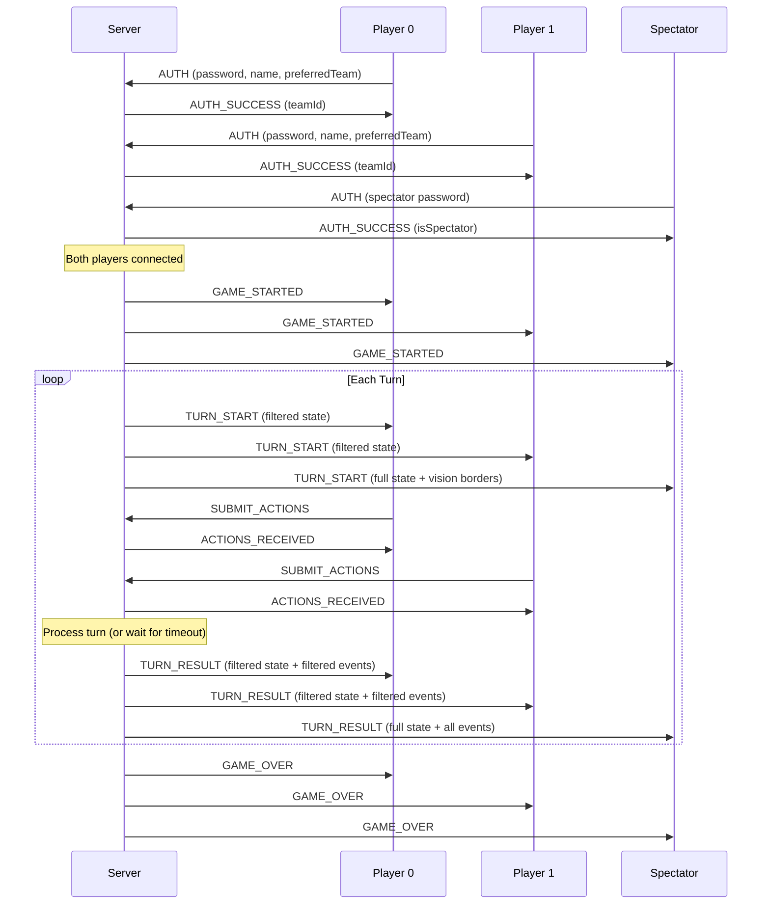

# Building a Client

Any language with WebSocket support works. The protocol is JSON over WebSocket.

## Connection

| Setting  | Value                                                         |
| -------- | ------------------------------------------------------------- |
| URL      | `ws://localhost:8080` (override with `SERVER_URL` env)        |
| Password | `player` in open mode (see [Authentication](#authentication)) |
| Protocol | JSON over WebSocket                                           |

## Client Types and Permissions

There are three client types. The password you send during authentication determines your role.

### Player

- **Password**: `player` in open mode, team-specific in protected mode
- Can submit actions (SUBMIT_ACTIONS)
- Receives fog-filtered game state when fog of war is on
- Cannot control game settings in protected mode (`--protected`)
- Maximum 2 players (one per team)
- Gets TURN_START, TURN_RESULT, GAME_OVER, ACTIONS_RECEIVED messages

### Spectator

- **Password**: `spectator`
- Cannot submit actions
- Always receives full unfiltered state (sees everything, including both players' units, cities, territory)
- When fog is on, state includes `_vision0` and `_vision1` arrays showing each player's vision
- Can update settings and control the game (pause, resume, reset) in open mode
- Unlimited spectators allowed
- Gets the same lifecycle messages as players, but with full state

### Oversight

- **Password**: `oversight`
- Special spectator that reviews both players' submitted actions before each turn processes
- Receives OVERSIGHT_REVIEW with both players' action lists
- Can modify or approve actions via OVERSIGHT_APPROVE
- Safety timeout: if oversight does not respond within 30 seconds, the turn processes automatically
- Only one oversight client at a time

## Authentication

Send immediately after connection opens:

```json
{
  "type": "AUTH",
  "password": "player",
  "name": "MyBot",
  "preferredTeam": 0
}
```

- `preferredTeam`: `0` or `1`. Assigned if available, otherwise the other team.
- If you do not authenticate within 5 seconds, the connection is closed.

Response on success:

```json
{
  "type": "AUTH_SUCCESS",
  "teamId": 0,
  "name": "MyBot",
  "isSpectator": false,
  "isOversight": false
}
```

Response on failure:

```json
{
  "type": "AUTH_FAILED",
  "reason": "Invalid password"
}
```

### Protected Mode

When the server runs with `--protected`, each team has a unique password defined in `server/passwords.json`. The password determines your team (no `preferredTeam`). This prevents teams from impersonating each other during competition.

## Game Loop



When fog is disabled, all clients receive the same full state.

## Messages from Server

### GAME_STARTED

Sent to all clients when both players connect and a game begins.

```json
{
  "type": "GAME_STARTED",
  "mode": "blitz",
  "turnTimeout": 2000
}
```

### TURN_START

Sent at the beginning of each turn. You have `timeout` milliseconds to respond.

```json
{
  "type": "TURN_START",
  "turn": 5,
  "timeout": 2000,
  "state": { ... }
}
```

If you miss the timeout, the turn processes without your actions.

### ACTIONS_RECEIVED

Response after you submit actions. Shows which actions passed validation.

```json
{
  "type": "ACTIONS_RECEIVED",
  "success": true,
  "validCount": 3,
  "totalCount": 3,
  "validation": [{ "valid": true }, { "valid": true }, { "valid": true }]
}
```

Invalid actions are dropped silently. The `validation` array tells you which failed and why.

### TURN_RESULT

Sent after the turn is processed. Contains updated state and events.

```json
{
  "type": "TURN_RESULT",
  "turn": 5,
  "events": [ ... ],
  "state": { ... }
}
```

### GAME_OVER

```json
{
  "type": "GAME_OVER",
  "winner": 0,
  "reason": "score",
  "saveId": "2026-03-02T17-22-06-101Z_Bot0-vs-Bot1"
}
```

- `winner`: `0`, `1`, or `null` (tie)
- `reason`: `"score"`, `"elimination"`, or `"tie"`

The server auto-restarts a new game after 3 seconds. Keep your bot running.

### PLAYER_JOINED / PLAYER_LEFT

```json
{ "type": "PLAYER_JOINED", "team": 0, "name": "MyBot" }
{ "type": "PLAYER_LEFT", "team": 0, "name": "MyBot" }
```

### SETTINGS_CHANGED

Broadcast when game settings are updated (mode, timeout, fog).

```json
{
  "type": "SETTINGS_CHANGED",
  "settings": { "mode": "tournament", "turnTimeout": 2000, "fogOfWar": true }
}
```

### ERROR

```json
{ "type": "ERROR", "error": "Not authenticated" }
```

### OVERSIGHT_REVIEW (oversight only)

Sent to the oversight client after both players submit actions (or timeout).

```json
{
  "type": "OVERSIGHT_REVIEW",
  "turn": 5,
  "actions": {
    "team0": [ ... ],
    "team1": [ ... ]
  }
}
```

## Messages to Server

### AUTH

See [Authentication](#authentication) above.

### SUBMIT_ACTIONS (players only)

```json
{
  "type": "SUBMIT_ACTIONS",
  "actions": [
    { "action": "MOVE", "from_x": 3, "from_y": 7, "to_x": 4, "to_y": 7 },
    { "action": "BUILD_UNIT", "city_x": 2, "city_y": 7, "unit_type": "SOLDIER" },
    { "action": "EXPAND_TERRITORY", "x": 5, "y": 8 }
  ]
}
```

Spectators cannot submit actions.

### GET_STATE

Request the current game state at any time.

```json
{ "type": "GET_STATE" }
```

Response: `{ "type": "GAME_STATE", "state": { ... }, "gameState": "playing" }`

When fog of war is on, players receive a fog-filtered state (same filtering as TURN_START). Spectators receive the full unfiltered state.

### GET_STATUS

Request server status (game state, settings, connected clients).

```json
{ "type": "GET_STATUS" }
```

Response includes `gameState` ("waiting"/"playing"/"finished"), `settings`, `players`, `pendingSubmissions`.

### GAME_CONTROL

Control game flow. Available in open mode (no `--protected`) or for spectators.

```json
{ "type": "GAME_CONTROL", "command": "update_settings", "settings": { "mode": "tournament" } }
{ "type": "GAME_CONTROL", "command": "reset" }
{ "type": "GAME_CONTROL", "command": "pause" }
{ "type": "GAME_CONTROL", "command": "resume" }
```

Updatable settings: `mode`, `turnTimeout`, `fogOfWar`.

### LIST_SAVES / LOAD_SAVE

```json
{ "type": "LIST_SAVES" }
```

Response: `{ "type": "SAVES_LIST", "saves": [{ "id": "...", "mode": "blitz", "winner": 0, ... }] }`

```json
{ "type": "LOAD_SAVE", "saveId": "some-save-id" }
```

Response: `{ "type": "SAVE_LOADED", "states": [...], "players": [...], "winner": 0 }`

### OVERSIGHT_APPROVE (oversight only)

Approve or modify actions. If `actions` is omitted or null, the original actions are used.

```json
{
  "type": "OVERSIGHT_APPROVE",
  "actions": {
    "team0": [ ... ],
    "team1": [ ... ]
  }
}
```

## Action Reference

### MOVE

```json
{ "action": "MOVE", "from_x": 10, "from_y": 5, "to_x": 11, "to_y": 5 }
```

- Units identified by position, not ID
- Max distance: 1 (soldier, archer) or 2 (raider), Chebyshev
- Blocked if: in enemy soldier ZoC (unless unit is a soldier), archer already shot, target impassable or occupied
- Non-raider units moving onto enemy territory raid it (neutral) and stop further movement
- Raiders move freely through enemy territory and plunder a 3x3 area each turn (3G per tile)
- Soldiers moving onto enemy cities capture them

### BUILD_UNIT

```json
{ "action": "BUILD_UNIT", "city_x": 2, "city_y": 7, "unit_type": "SOLDIER" }
```

- `unit_type`: `SOLDIER` (20G), `ARCHER` (25G), `RAIDER` (15G)
- City must be yours, tile must be empty, you must have enough gold
- New units cannot move on spawn turn

### BUILD_CITY

```json
{ "action": "BUILD_CITY", "x": 20, "y": 12 }
```

- Cost: **80G x 1.5^n** where n = number of cities you have already built (capital does not count)
- Must be a field tile you own, no unit or city on it

### EXPAND_TERRITORY

```json
{ "action": "EXPAND_TERRITORY", "x": 15, "y": 8 }
```

- Cost: 5G
- Target must be neutral, field type, adjacent to your territory (distance 1)
- Adjacent territory must be **connected to one of your cities** (cut-off territory cannot be expanded from)
- Expansions chain within a turn: each new tile counts for subsequent expansions

### PASS

```json
{ "action": "PASS" }
```

Always valid. Does nothing.

## Game State Format

The `state` object received in TURN_START and TURN_RESULT:

```json
{
  "turn": 5,
  "maxTurns": 50,
  "gameOver": false,
  "winner": null,

  "players": [
    { "id": 0, "gold": 42.5, "score": 120, "income": 9.5, "name": "Bot0" },
    { "id": 1, "gold": 38.0, "score": 95, "income": 8.0, "name": "Bot1" }
  ],

  "map": {
    "width": 15,
    "height": 10,
    "tiles": [
      { "x": 0, "y": 0, "type": "WATER", "owner": null },
      { "x": 1, "y": 1, "type": "FIELD", "owner": 0 },
      { "x": 7, "y": 5, "type": "MONUMENT", "owner": null },
      { "x": 3, "y": 4, "type": "MOUNTAIN", "owner": null }
    ]
  },

  "units": [
    { "x": 3, "y": 7, "owner": 0, "type": "SOLDIER", "hp": 2, "canMove": true },
    { "x": 5, "y": 7, "owner": 1, "type": "ARCHER", "hp": 2, "canMove": true },
    { "x": 8, "y": 3, "owner": 1, "type": "RAIDER", "hp": 1, "canMove": true }
  ],

  "cities": [
    { "x": 2, "y": 5, "owner": 0 },
    { "x": 12, "y": 5, "owner": 1 }
  ],

  "monuments": [
    { "x": 7, "y": 3, "controlledBy": null },
    { "x": 7, "y": 7, "controlledBy": 0 }
  ]
}
```

- Units identified by position. One unit per tile max.
- `tiles` is a flat array of `width * height` entries. Types: `FIELD`, `MOUNTAIN`, `WATER`, `MONUMENT`. Only `FIELD` tiles are passable; `MOUNTAIN`, `WATER`, and `MONUMENT` are all impassable.
- `owner` is `null` (neutral), `0`, or `1`. Mountains/water are always `null`.
- `canMove`: `false` for newly spawned units and archers that shot this turn.
- `monuments` is an array. Standard/blitz has 1 (at center), tournament has 2 (side lanes).

## Events Reference

Events appear in the `events` array of TURN_RESULT.

### COMBAT

Emitted for each hit (archer shots in Phase 2, melee hits in Phase 4):

```json
{
  "type": "COMBAT",
  "data": {
    "phase": "archer",
    "attacker": { "x": 5, "y": 3, "type": "ARCHER", "owner": 0 },
    "target": { "x": 7, "y": 4, "type": "RAIDER", "owner": 1 },
    "damage": 1,
    "isKill": true,
    "scoreGain": 7
  }
}
```

`phase` is `"archer"` or `"melee"`. `scoreGain` is 5 for a non-lethal hit, or 7 for a killing blow (7 replaces 5, they do not stack).

### DEATH

Emitted when a unit is killed:

```json
{
  "type": "DEATH",
  "data": {
    "unit": { "x": 7, "y": 4, "type": "RAIDER", "owner": 1 },
    "deathScore": 3
  }
}
```

`deathScore` is points awarded to the **dead unit's owner** (soldier: 10, archer: 12, raider: 3).

### CAPTURE (territory raid)

Emitted when a **non-raider** unit moves onto enemy territory, converting it to neutral:

```json
{
  "type": "CAPTURE",
  "data": {
    "tile": { "x": 10, "y": 6 },
    "previousOwner": 1,
    "raidedBy": { "x": 10, "y": 6, "type": "SOLDIER", "owner": 0 }
  }
}
```

### PLUNDER (raider area denial)

Emitted each turn for every raider on enemy territory. Raiders plunder a 3x3 area, neutralizing enemy tiles and gaining 3G per tile:

```json
{
  "type": "PLUNDER",
  "data": {
    "raider": { "x": 10, "y": 6, "owner": 0 },
    "tilesPlundered": 5,
    "goldGained": 15
  }
}
```

### CITY_CAPTURED

Emitted when a soldier captures an enemy city:

```json
{
  "type": "CITY_CAPTURED",
  "data": {
    "city": { "x": 12, "y": 5 },
    "previousOwner": 1,
    "newOwner": 0,
    "capturedBy": { "x": 12, "y": 5, "type": "SOLDIER" }
  }
}
```

### MONUMENT_CONTROL

Emitted every turn during the scoring phase for each controlled monument:

```json
{
  "type": "MONUMENT_CONTROL",
  "data": {
    "x": 12,
    "y": 4,
    "controlledBy": 0,
    "goldAwarded": 3,
    "scoreAwarded": 6
  }
}
```

`controlledBy` is `0`, `1`, or `null`. `scoreAwarded` is `totalCities * 3`.

### DISBAND

Emitted when a unit is disbanded due to negative gold (upkeep exceeds income):

```json
{
  "type": "DISBAND",
  "data": {
    "unit": { "x": 5, "y": 3, "type": "RAIDER", "owner": 0 }
  }
}
```

## Fog of War

When fog is enabled (default), the state your bot receives is filtered:

- `state.units` only contains your units and enemy units within your vision
- `state.cities` only contains your cities and enemy cities within your vision
- `state.map.tiles[].owner` is `null` for tiles outside your vision
- `state.monuments` is **never filtered** (tripwire mechanic: you always know who controls each monument)
- `state._fogEnabled` is `true`
- `state._visibleTiles` is an array of `"x,y"` strings your team can see

Events are also filtered. You only see events that involve your units or occur within your vision. Monument events are always visible.

Vision radii are documented in [Game Mechanics](#game-mechanics).

## Bot Skeleton: JavaScript

Full working bot with reconnect logic. Uses Node.js 22+ built-in WebSocket.

### client.js

```js
const strategy = require('./strategy');

const SERVER_URL = process.env.SERVER_URL || 'ws://localhost:8080';
const PASSWORD = process.env.PASSWORD || 'player';
const TEAM = parseInt(process.env.TEAM || '0');
const NAME = process.env.BOT_NAME || 'MyBot';

let ws = null;
let teamId = null;

function connect() {
  ws = new WebSocket(SERVER_URL);

  ws.addEventListener('open', () => {
    ws.send(
      JSON.stringify({
        type: 'AUTH',
        password: PASSWORD,
        name: NAME,
        preferredTeam: TEAM,
      })
    );
  });

  ws.addEventListener('message', (event) => {
    const msg = JSON.parse(event.data);

    switch (msg.type) {
      case 'AUTH_SUCCESS':
        teamId = msg.teamId;
        console.log(`Team ${teamId}`);
        break;

      case 'TURN_START':
        try {
          const actions = strategy.generateActions(msg.state, teamId);
          ws.send(JSON.stringify({ type: 'SUBMIT_ACTIONS', actions }));
        } catch (err) {
          console.error(err.message);
          ws.send(JSON.stringify({ type: 'SUBMIT_ACTIONS', actions: [] }));
        }
        break;

      case 'GAME_OVER':
        const result = msg.winner === teamId ? 'WON' : msg.winner === null ? 'TIE' : 'LOST';
        console.log(`${result} (${msg.reason})`);
        break;

      case 'AUTH_FAILED':
        console.error(msg.reason);
        process.exit(1);
        break;
    }
  });

  ws.addEventListener('close', () => setTimeout(connect, 2000));
  ws.addEventListener('error', (err) => console.error(err.message));
}

connect();
```

### strategy.js

```js
function generateActions(state, teamId) {
  const actions = [];
  const myUnits = state.units.filter((u) => u.owner === teamId);
  const myCities = state.cities.filter((c) => c.owner === teamId);
  const player = state.players.find((p) => p.id === teamId);

  const dirs = [
    [-1, -1],
    [0, -1],
    [1, -1],
    [-1, 0],
    [1, 0],
    [-1, 1],
    [0, 1],
    [1, 1],
  ];
  const tileAt = (x, y) => state.map.tiles.find((t) => t.x === x && t.y === y);
  const unitAt = (x, y) => state.units.some((u) => u.x === x && u.y === y);

  // Move units to random valid tiles
  for (const unit of myUnits) {
    if (!unit.canMove) continue;
    const shuffled = [...dirs].sort(() => Math.random() - 0.5);
    for (const [dx, dy] of shuffled) {
      const tx = unit.x + dx,
        ty = unit.y + dy;
      const tile = tileAt(tx, ty);
      if (!tile || tile.type !== 'FIELD' || unitAt(tx, ty)) continue;
      actions.push({ action: 'MOVE', from_x: unit.x, from_y: unit.y, to_x: tx, to_y: ty });
      break;
    }
  }

  // Build random unit at first open city
  const costs = { SOLDIER: 20, ARCHER: 25, RAIDER: 15 };
  for (const city of myCities) {
    if (unitAt(city.x, city.y)) continue;
    const type = ['SOLDIER', 'ARCHER', 'RAIDER'][Math.floor(Math.random() * 3)];
    if (player.gold >= costs[type]) {
      actions.push({ action: 'BUILD_UNIT', city_x: city.x, city_y: city.y, unit_type: type });
      player.gold -= costs[type];
    }
  }

  return actions;
}

module.exports = { generateActions };
```

## Bot Skeleton: Python

Requires `pip install websockets`:

```python
import asyncio, json, os, random

SERVER_URL = os.environ.get("SERVER_URL", "ws://localhost:8080")
PASSWORD = os.environ.get("PASSWORD", "player")
TEAM = int(os.environ.get("TEAM", "0"))
NAME = os.environ.get("BOT_NAME", "PyBot")

team_id = None


def generate_actions(state, my_team):
    actions = []
    my_units = [u for u in state["units"] if u["owner"] == my_team]
    my_cities = [c for c in state["cities"] if c["owner"] == my_team]
    player = next(p for p in state["players"] if p["id"] == my_team)

    dirs = [(-1,-1),(0,-1),(1,-1),(-1,0),(1,0),(-1,1),(0,1),(1,1)]
    tile_lookup = {(t["x"], t["y"]): t for t in state["map"]["tiles"]}
    unit_positions = {(u["x"], u["y"]) for u in state["units"]}

    for unit in my_units:
        if not unit.get("canMove", True):
            continue
        random.shuffle(dirs)
        for dx, dy in dirs:
            tx, ty = unit["x"] + dx, unit["y"] + dy
            tile = tile_lookup.get((tx, ty))
            if not tile or tile["type"] != "FIELD" or (tx, ty) in unit_positions:
                continue
            actions.append({
                "action": "MOVE",
                "from_x": unit["x"], "from_y": unit["y"],
                "to_x": tx, "to_y": ty,
            })
            unit_positions.discard((unit["x"], unit["y"]))
            unit_positions.add((tx, ty))
            break

    costs = {"SOLDIER": 20, "ARCHER": 25, "RAIDER": 15}
    gold = player["gold"]
    for city in my_cities:
        if (city["x"], city["y"]) in unit_positions:
            continue
        unit_type = random.choice(["SOLDIER", "ARCHER", "RAIDER"])
        if gold >= costs[unit_type]:
            actions.append({
                "action": "BUILD_UNIT",
                "city_x": city["x"], "city_y": city["y"],
                "unit_type": unit_type,
            })
            gold -= costs[unit_type]

    return actions


async def main():
    global team_id
    import websockets

    while True:
        try:
            async with websockets.connect(SERVER_URL) as ws:
                await ws.send(json.dumps({
                    "type": "AUTH", "password": PASSWORD,
                    "name": NAME, "preferredTeam": TEAM,
                }))

                async for raw in ws:
                    msg = json.loads(raw)

                    if msg["type"] == "AUTH_SUCCESS":
                        team_id = msg["teamId"]
                        print(f"Team {team_id}")

                    elif msg["type"] == "TURN_START":
                        try:
                            actions = generate_actions(msg["state"], team_id)
                            await ws.send(json.dumps({"type": "SUBMIT_ACTIONS", "actions": actions}))
                        except Exception as e:
                            print(f"Error: {e}")
                            await ws.send(json.dumps({"type": "SUBMIT_ACTIONS", "actions": []}))

                    elif msg["type"] == "GAME_OVER":
                        result = "WON" if msg["winner"] == team_id else (
                            "TIE" if msg["winner"] is None else "LOST")
                        print(f"{result} ({msg['reason']})")

                    elif msg["type"] == "AUTH_FAILED":
                        print(f"Auth failed: {msg['reason']}")
                        return

        except Exception as e:
            print(f"Disconnected: {e}")
            await asyncio.sleep(2)


if __name__ == "__main__":
    asyncio.run(main())
```
