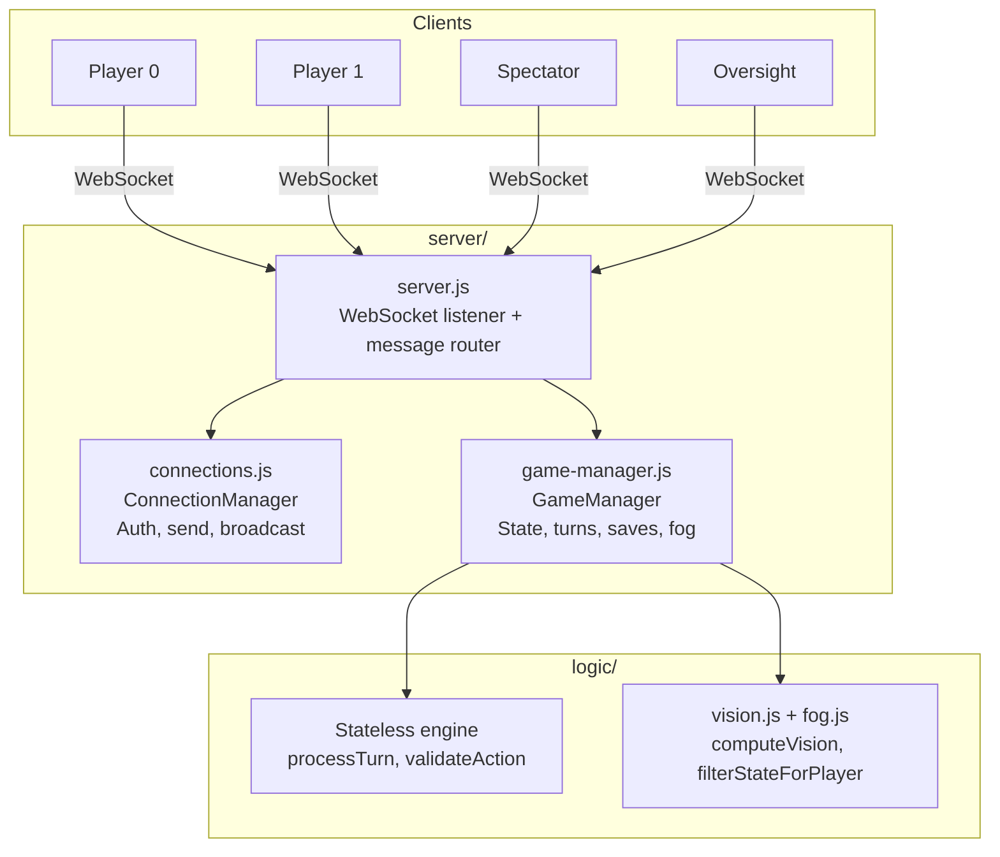
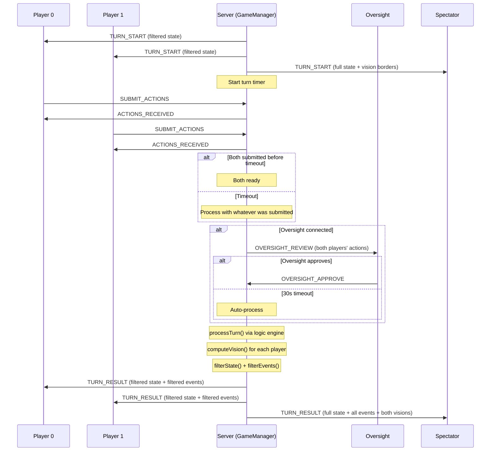

# Server Reference

The game server wraps the stateless `logic/` engine with WebSocket multiplayer, authentication, turn timeouts, fog of war filtering, game saves, and an oversight review system.

## Architecture



`server.js` receives WebSocket messages, authenticates via `ConnectionManager`, and routes game actions to `GameManager`. The GameManager calls into `logic/` for turn processing and fog filtering, then emits results back through the ConnectionManager.

## How the Server Works

### Game Lifecycle

The server cycles through three states:

1. **Waiting** -- server is up, waiting for two players to connect and authenticate
2. **Playing** -- both players connected, turns processing in a loop (TURN_START -> collect actions -> process -> TURN_RESULT -> repeat)
3. **Finished** -- game over, save written to disk, auto-restart after 3 seconds

When both players are connected, the game starts automatically. When a game ends, the server waits 3 seconds and starts a new game if both players are still connected. This loop continues indefinitely.

### Turn Processing

Each turn:

1. Server sends TURN_START to all clients (fog-filtered for players, full state for spectators)
2. Starts the turn timer (default 2 seconds)
3. Waits for both players to submit actions (or timeout)
4. If an oversight client is connected, sends actions for review (30-second safety timeout)
5. Calls `processTurn()` from the logic engine
6. Computes per-player vision and filters state/events through fog of war
7. Sends TURN_RESULT to all clients (fog-filtered for players, full for spectators)
8. If the game is over, transitions to Finished; otherwise starts the next turn

If a player does not submit actions before the timeout, their turn is processed with an empty action list.

### Action Validation

When a player submits actions, the server validates each one individually using `validateAction()` from the logic engine. The server responds with ACTIONS_RECEIVED containing a `validation` array that shows which actions passed and which failed (with error reasons). Invalid actions are silently dropped -- only valid actions are used for turn processing.

EXPAND_TERRITORY actions are validated with chaining support: each valid expand in the list temporarily counts as owned territory for subsequent expands. This lets you queue a chain of adjacent expansions in a single turn.

```json
{
  "type": "ACTIONS_RECEIVED",
  "success": true,
  "validCount": 2,
  "totalCount": 3,
  "validation": [
    { "valid": true },
    { "valid": true },
    { "valid": false, "error": "Target (5, 3) is not passable" }
  ]
}
```

### Fog of War Filtering

When fog is enabled (default), the server produces three different views each turn:

- **Player 0**: state filtered through Player 0's vision (hidden units/cities/territory removed)
- **Player 1**: state filtered through Player 1's vision
- **Spectator**: full unfiltered state with `_vision0` and `_vision1` arrays showing each player's visible tiles

GET_STATE responses are also fog-filtered: players get their filtered view, spectators get the full state.

## CLI Flags

```bash
node server/server.js [flags]
```

| Flag            | Default   | Description                                                                |
| --------------- | --------- | -------------------------------------------------------------------------- |
| `--port=N`      | `8080`    | WebSocket server port (also via `PORT` env)                                |
| `--mode=X`      | `blitz`   | Game mode: `blitz`, `standard`, or `tournament`                            |
| `--standard`    |           | Shorthand for `--mode=standard`                                            |
| `--tournament`  |           | Shorthand for `--mode=tournament`                                          |
| `--timeout=N`   | `2000`    | Turn timeout in milliseconds                                               |
| `--protected`   | off       | Protected mode: team passwords required, client settings override disabled |
| `--no-fog`      | fog is on | Disable fog of war (full information mode)                                 |
| `--max-saves=N` | `20`      | Maximum save files to keep (oldest pruned)                                 |

Example:

```bash
node server/server.js --tournament --timeout=3000 --no-fog
```

## File Descriptions

### server.js

WebSocket listener on the configured port. Handles connection lifecycle (open, message, close, error), message routing to handler functions, game event broadcasting (per-player fog filtering, spectator full state, oversight review), and CLI argument parsing.

### connections.js

`ConnectionManager` class. Manages WebSocket connections with auth state, 5-second auth timeout, password-based authentication (open mode with shared password or protected mode with per-team passwords), unique name generation, and targeted messaging: `send(ws)`, `broadcast()`, `broadcastToPlayers()`, `broadcastToSpectators()`, `sendToTeam(teamId)`, `sendToOversight()`.

### game-manager.js

`GameManager` class. Manages the game lifecycle (waiting/playing/finished), turn processing with expand-territory chaining, turn timeouts, fog of war computation and filtering, settings (mode, turnTimeout, fogOfWar), pause/resume, auto-save to `server/saves/`, and oversight review with safety timeout.

### passwords.json

```json
{
  "players": "player",
  "spectator": "spectator",
  "oversight": "oversight",
  "0": "team0_change_me",
  "1": "team1_change_me"
}
```

In open mode, `players` password is used for both teams. In protected mode (`--protected`), keys `"0"` and `"1"` are the per-team passwords.

## Message Reference

### Client to Server

#### AUTH

Authenticate immediately after connecting. Must be sent within 5 seconds or the connection is closed.

```json
{
  "type": "AUTH",
  "password": "player",
  "name": "MyBot",
  "preferredTeam": 0
}
```

#### SUBMIT_ACTIONS (players only)

Submit actions for the current turn. Spectators cannot submit.

```json
{
  "type": "SUBMIT_ACTIONS",
  "actions": [
    { "action": "MOVE", "from_x": 3, "from_y": 7, "to_x": 4, "to_y": 7 },
    { "action": "BUILD_UNIT", "city_x": 2, "city_y": 7, "unit_type": "SOLDIER" }
  ]
}
```

#### GET_STATE

Request the current game state. Players receive fog-filtered state; spectators receive full state.

```json
{ "type": "GET_STATE" }
```

#### GET_STATUS

Request server status (game state, settings, connected clients).

```json
{ "type": "GET_STATUS" }
```

#### GAME_CONTROL

Control game flow. Available in open mode (no `--protected`) for any authenticated client.

```json
{ "type": "GAME_CONTROL", "command": "update_settings", "settings": { "mode": "tournament" } }
{ "type": "GAME_CONTROL", "command": "reset" }
{ "type": "GAME_CONTROL", "command": "pause" }
{ "type": "GAME_CONTROL", "command": "resume" }
```

Updatable settings: `mode`, `turnTimeout`, `fogOfWar`. Changing mode during a game restarts with a new map.

Pause destroys the current game and prevents new games from starting. Resume allows new games.

#### LIST_SAVES

```json
{ "type": "LIST_SAVES" }
```

#### LOAD_SAVE

```json
{ "type": "LOAD_SAVE", "saveId": "2026-03-02T17-18-00_Bot0-vs-Bot1" }
```

#### OVERSIGHT_APPROVE (oversight only)

Approve or modify pending actions. Omit `actions` to approve the original actions as-is.

```json
{
  "type": "OVERSIGHT_APPROVE",
  "actions": {
    "team0": [ ... ],
    "team1": [ ... ]
  }
}
```

### Server to Client

#### AUTH_SUCCESS

```json
{
  "type": "AUTH_SUCCESS",
  "teamId": 0,
  "name": "MyBot",
  "isSpectator": false,
  "isOversight": false
}
```

#### AUTH_FAILED

Connection is closed after this message.

```json
{ "type": "AUTH_FAILED", "reason": "Invalid password" }
```

#### GAME_STARTED

Sent to all clients when both players connect and a game begins.

```json
{
  "type": "GAME_STARTED",
  "mode": "tournament",
  "turnTimeout": 2000
}
```

#### TURN_START

Sent at the beginning of each turn. Players get fog-filtered state; spectators get full state with vision arrays.

```json
{
  "type": "TURN_START",
  "turn": 5,
  "timeout": 2000,
  "state": { ... }
}
```

#### ACTIONS_RECEIVED

Response after submitting actions. Shows which passed validation.

```json
{
  "type": "ACTIONS_RECEIVED",
  "success": true,
  "validCount": 2,
  "totalCount": 3,
  "validation": [
    { "valid": true },
    { "valid": true },
    { "valid": false, "error": "Target (5, 3) is not passable" }
  ]
}
```

#### TURN_RESULT

Sent after the turn is processed.

```json
{
  "type": "TURN_RESULT",
  "turn": 5,
  "events": [ ... ],
  "state": { ... }
}
```

#### GAME_OVER

```json
{
  "type": "GAME_OVER",
  "winner": 0,
  "reason": "score",
  "saveId": "2026-03-02T17-22-06-101Z_Bot0-vs-Bot1"
}
```

`winner`: `0`, `1`, or `null` (tie). `reason`: `"score"`, `"elimination"`, or `"tie"`. The server auto-restarts after 3 seconds.

#### PLAYER_JOINED / PLAYER_LEFT

```json
{ "type": "PLAYER_JOINED", "team": 0, "name": "MyBot" }
{ "type": "PLAYER_LEFT", "team": 0, "name": "MyBot" }
```

#### SETTINGS_CHANGED

Broadcast to all clients when settings change.

```json
{
  "type": "SETTINGS_CHANGED",
  "settings": { "mode": "tournament", "turnTimeout": 2000, "fogOfWar": true }
}
```

#### GAME_STATE

Response to GET_STATE.

```json
{
  "type": "GAME_STATE",
  "state": { ... },
  "gameState": "playing"
}
```

`gameState` is `"waiting"`, `"playing"`, or `"finished"`. When fog is on, players receive filtered state; spectators receive full state.

#### SERVER_STATUS

Response to GET_STATUS.

```json
{
  "type": "SERVER_STATUS",
  "gameState": "playing",
  "paused": false,
  "settings": { "mode": "tournament", "turnTimeout": 2000, "fogOfWar": true },
  "currentTurn": 42,
  "players": [ ... ],
  "pendingSubmissions": { "team0": true, "team1": false }
}
```

#### SETTINGS_UPDATED

Response to GAME_CONTROL update_settings.

```json
{
  "type": "SETTINGS_UPDATED",
  "success": true,
  "settings": { "mode": "tournament", "turnTimeout": 2000, "fogOfWar": true }
}
```

If mode changed during a game, includes `"restarted": true`.

#### PAUSE_UPDATED

Response to GAME_CONTROL pause/resume.

```json
{ "type": "PAUSE_UPDATED", "success": true, "paused": true }
```

#### GAME_RESET

Broadcast when the game is reset (via GAME_CONTROL reset, pause, or mode change during a game).

```json
{ "type": "GAME_RESET", "success": true }
```

#### SAVES_LIST

Response to LIST_SAVES.

```json
{
  "type": "SAVES_LIST",
  "saves": [
    {
      "id": "2026-03-02T17-18-00_Bot0-vs-Bot1",
      "timestamp": "2026-03-02T17:18:00.238Z",
      "mode": "tournament",
      "players": [
        { "id": 0, "name": "Bot0" },
        { "id": 1, "name": "Bot1" }
      ],
      "winner": 0,
      "winReason": "score",
      "finalTurn": 350,
      "maxTurns": 350
    }
  ]
}
```

#### SAVE_LOADED

Response to LOAD_SAVE.

```json
{
  "type": "SAVE_LOADED",
  "success": true,
  "id": "2026-03-02T17-18-00_Bot0-vs-Bot1",
  "players": [{ "id": 0, "name": "Bot0" }, { "id": 1, "name": "Bot1" }],
  "winner": 0,
  "winReason": "score",
  "states": [ ... ]
}
```

`states` is the full state history (one per turn). Returns `{ "success": false, "reason": "Save not found" }` on failure.

#### OVERSIGHT_REVIEW (oversight only)

Sent after both players submit (or timeout). The oversight client has 30 seconds to approve or modify.

```json
{
  "type": "OVERSIGHT_REVIEW",
  "turn": 5,
  "actions": {
    "team0": [ ... ],
    "team1": [ ... ]
  }
}
```

#### ERROR

```json
{ "type": "ERROR", "error": "Not authenticated" }
```

## Turn Flow



When fog is disabled, all clients receive the same full state and events.
